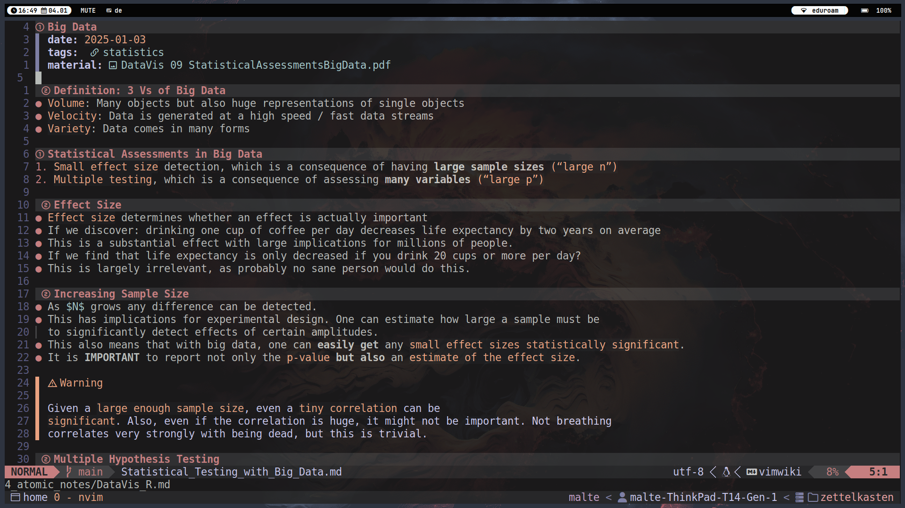
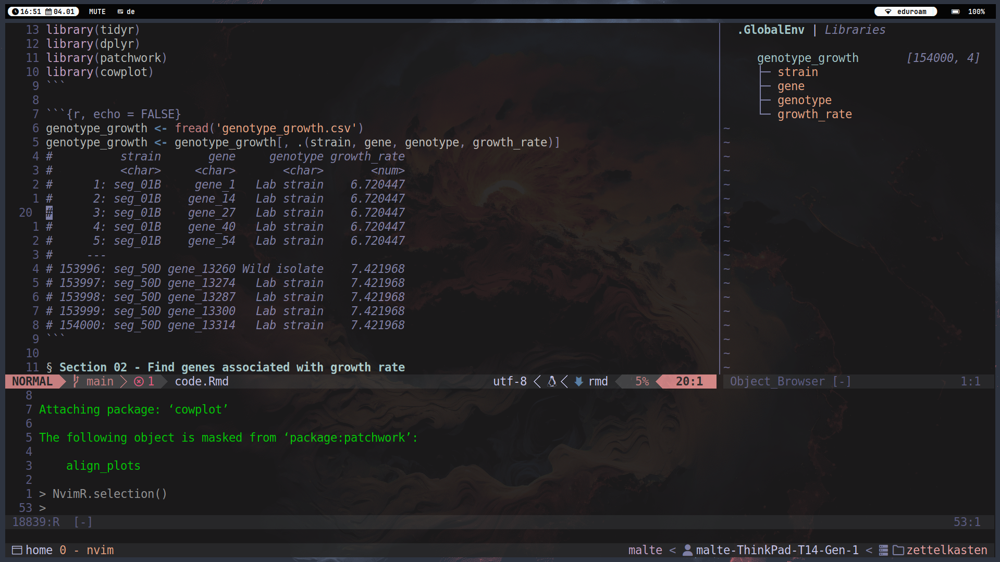

# dotfiles

These are my personal dotfiles that I use for my Bioinformatics studies. 
I am a big fan of [vimwiki](https://github.com/vimwiki/vimwiki) and use it for all my university-related notes.

## Images

